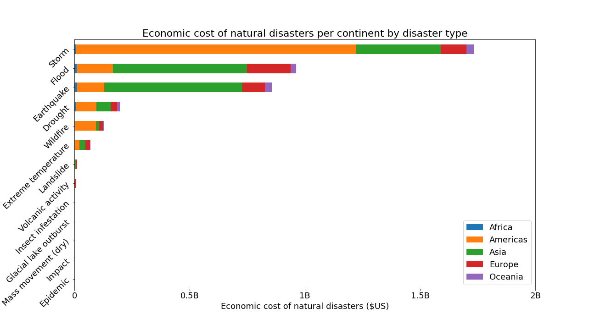

# The Emergency Events Database

The emergency events database contains essential core data on the occurrence and effects of over 22,000 mass disasters in the world from 1900 to 2021. The database is compiled from various sources, including UN agencies, non-governmental organisations, insurance companies, research institutes and press agencies. This data set information can be found [here](https://www.emdat.be)   

## Trend of Natural Disaster by Continent, Country, and Types

- The predominant causes of natural disasters are flood and storm, with most occurances in Asia and the Americas, particularly in the United States and China.

- Storm have resulted in the highest economic cost over the years.

## Number of Occurrences of  Nautral Disaster

- Natural disasters occurrences were minimal between the 1900s and 1910s, likely due to limited data. However, as time progressed, the frequency of natural disasters increased exponentially, particularly between 1990 and 2004. Afterwards, there appears to be a decline.

- The occurrence rate of earthquakes is decreasing, while the occurrence rate of floods and storms is on the rise.

## Number of Deaths from  Natural Disaster

- The total number of deaths fluctuates over the years, with a peak in 1920s marking the highest recorded number of death from natural disasters. From 2000s onwards, the number of recorded deaths is significantly lower, likely due to technological advances.

## Number of Homeless & Affected by  Natural Disaster

- Homelessness caused by natural disasters peaked between the 1990s and 2000s, aligning with the increased occurrence of natural disasters during this period.

- The total number of people affected by natural disasters peaked between the years 2000 and 2003, corresponding with the heightened frequency of natural disasters during this period. 

## Economic Cost of Natural Disaster

The economic cost of natural disaster appears to be increasing exponentially every decade, peaking in the 2010s. This surge is primarily due to storms and floods in the United States of America.

## Trends of Natural Disaster by Hour

## Trends of Natural Disaster by Start Month

